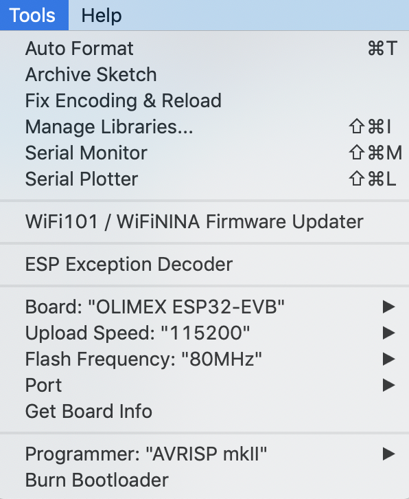

# IoT-sys-net-bp sensor firmware [](https://travis-ci.org/iot-bp-project-2018/sensor-firmware)

We built a prototype of an IoT / Cyber-Physical system-of-systems network.

This is the sensor firmware for the ESPs.

# Wiring

To set up the system of systems, please follow the [Wiring Guide](Resources/Wiring-Guide.pdf).

# Compilation

To compile please use the Arduino IDE.

## First Time Setup

The ESP8266 and ESP32 board packages as well as several libraries must be installed.

### Board Packages

Add the following two URLs under Arduino - Preferences - Additional Boards Manager URLs:

```
http://arduino.esp8266.com/stable/package_esp8266com_index.json
https://dl.espressif.com/dl/package_esp32_index.json
```

Then go to Tools - Board - Boards Manager... and install the following board packages:

- `esp8266` by `ESP8266 Communitiy` version `2.4.2`
- `esp32` by `Espressif Systems` version `1.0.1`

### Libraries

The following libraries are required and can be installed using the Library Manager.
For convenience the libraries are provided in `Resources/Libraries.zip` and can be extracted into the library folder of the IDE.

- `ArduinoJson` by `Benoit Blanchon` version `6.7.0-beta`
- `EspMQTTClient` by `Patrick Lapointe` version `1.0.0`

- `CAN` by `Sandeep Mistry` version `0.3.1`

- `DHT sensor library` by `Adafruit` version `1.3.4`
- `DHT sensor library for ESPx` by `beegee_tokyo` version `1.0.9`

- [Arduino Crypto](https://github.com/intrbiz/arduino-crypto) (not available in Library Manager)
- [PubSubClient](https://pubsubclient.knolleary.net/) (included in sketch folder to increase MQTT_MAX_PACKET_SIZE)

## Configuration

To configure the firmware change the following line in `SensorConfig.h`:

```
#define SENSOR_CONFIG SENSOR_KALLIOPE
```

There are several predefined configurations available as listed at the top of file.
To change the predefined configurations see the comments in `SensorConfig.h` and update the network configurations inside `CommProtoConfig.h`.

## Upload

To upload the firmware configure the Arduino IDE as follows:

ESP8266:


ESP32:


